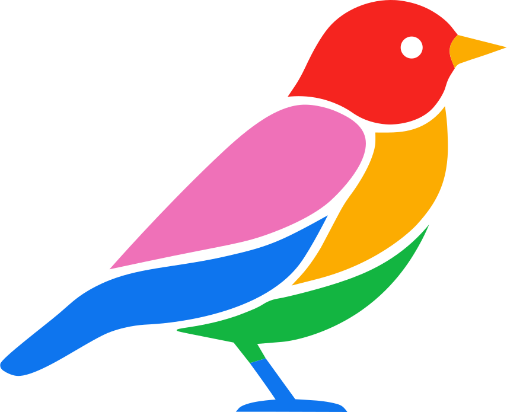

<div align="center">



# 🐦 Immerle

### *Your music, self-hosted — and it sings.*

</div>

Meet **Immerle** *(say it “I-mmerle” 🎶)* — a self-hosted music server that
speaks fluent **Subsonic / OpenSubsonic**, so every client you already love
(Supersonic, Symfonium, DSub, and friends) just works. Then it goes further:
friends, an activity feed, collaborative playlists, synchronized *Jam* listening
sessions, an on-demand catalog, playlist import, and optional federation. 🎉

One tiny **Go binary**. **SQLite** out of the box (Postgres if you outgrow it).
Drop in your music, hit play. That’s it. 🎵

### What’s in a name? 🤔

A little wink at [**Immich**](https://github.com/immich-app/immich), the
beloved self-hosted photo server whose name remains one of the great unsolved
mysteries of the homelab world 🕵️ — crossed with ***merle***, French for
**blackbird** 🐦, the songbird famous for its joyful, improvised whistling. A
self-hosted server, for music, that sings: **Immerle**. ✨

---

## ✨ What you get

- 🎧 **Works with your clients** — full Subsonic / OpenSubsonic: browsing,
  search, streaming, transcoding, playlists, scrobbling, now-playing.
- 🌍 **On-demand catalog** — pluggable providers (Jamendo, Internet Archive,
  and your own HTTP providers) stream tracks you don’t own yet, *progressively*
  on first play.
- 👯 **Social** — friends, an activity feed with per-event privacy, and
  collaborative or public/subscribable playlists.
- 🔊 **Jam sessions** — listen together, in sync, streamed live.
- 📥 **Playlist import** — bring your playlists over (Spotify and Deezer).
- 🔗 **Federation (opt-in)** — sync editorial & recommendation playlists via an
  `immerle-hub`.
- 🔐 **Solid auth** — Subsonic tokens, revocable device JWTs, and personal API
  tokens.
- 📖 **OpenAPI 3.1** + a built-in Swagger UI for the native API.

## 🚀 Quick start

### 🐳 Docker

Uses the prebuilt multi-arch image from GHCR — no local build needed.

```bash
# put your music under ./music, then:
docker compose up -d
# server on http://localhost:4533 — create the admin via the first-run setup:
curl -X POST http://localhost:4533/setup/init \
  -H 'Content-Type: application/json' \
  -d '{"username":"me","password":"a-strong-password"}'
```

Or without compose:

```bash
docker run -d -p 4533:4533 \
  -v "$PWD/music:/music:ro" -v immerle-data:/data \
  -e DATABASE_DSN=/data/immerle.db -e LIBRARY_DATA_DIR=/data \
  ghcr.io/immerle/immerle:latest
```

> Building from your checkout instead? Uncomment `build:` in
> `docker-compose.yml` and run `docker compose up --build`.

### 🛠️ From source

```bash
make build
cp .env.example .env   # edit as needed
./bin/immerle          # auto-loads .env (or pass -env path/to/.env)
```

You’ll need **Go 1.25+** and `ffmpeg`/`ffprobe` on your `PATH` (for transcoding,
duration probing and on-demand tag embedding).

Then point any Subsonic client at `http://<host>:4533` with the credentials you
just created — and enjoy. 🎈

## 📚 Going further

The friendly bit ends here; the full reference lives in **[DOCS.md](DOCS.md)**:

- 🔑 [First-run setup](DOCS.md#first-run-setup) — create your admin
- ⚙️ [Configuration](DOCS.md#configuration) — bootstrap `.env` + runtime admin API
- 🏗️ [Architecture](DOCS.md#architecture) — how it’s wired
- 🪺 [The native Immerle API](DOCS.md#the-native-immerle-api) — social, jams, imports, tokens
- 🌐 [On-demand providers & avatars](DOCS.md#on-demand-providers--artist-avatars) — the catalog
- 💻 [Development](DOCS.md#development) — build, test, contribute

## 🤝 Contributing

Issues and pull requests are very welcome! 🙌 Before opening a PR, run `make ci`
(it must pass) and regenerate the OpenAPI spec with `make openapi` if you touched
handler annotations — CI fails on a stale spec. See
[Development](DOCS.md#development) for the full loop.

## ⚖️ Disclaimer

Immerle's on-demand provider system is **content-neutral** by design: it can be
pointed at any backend. That neutrality is purely technical and is not an
endorsement of any particular use. **You are solely responsible** for ensuring
you have the legal right to access, store and distribute whatever content you
connect, and for complying with all applicable copyright and other laws. Immerle
and its maintainers provide the software only and **disclaim all responsibility
and liability** for how it is used or what content is served through it. See
[DISCLAIMER.md](DISCLAIMER.md).

## 🎨 Credits

The Immerle logo was designed by **Alicia SMITI** — thank you! 💖

## 📜 License

Immerle is free software, licensed under the **[GNU AGPLv3](LICENSE)**. You’re
free to use, study, share and improve it — just keep it free, and if you run a
modified version as a network service, share your changes too. 💚
