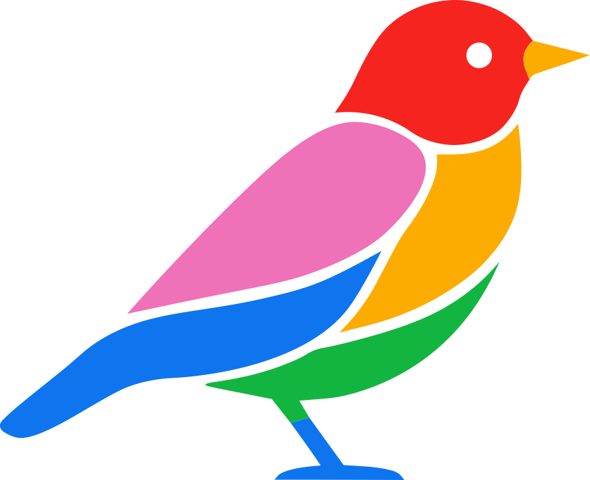
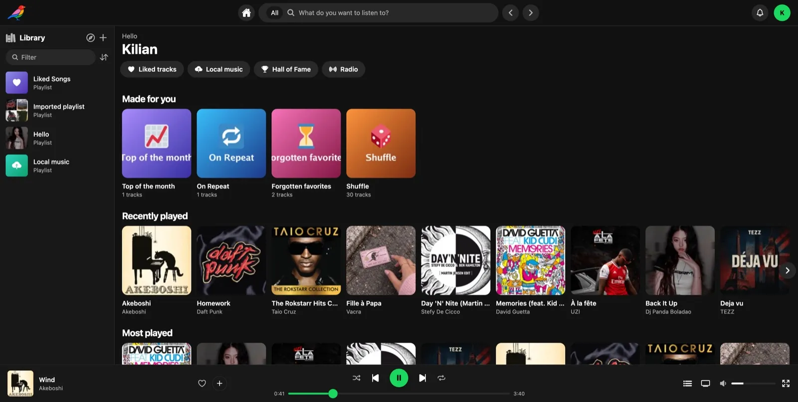
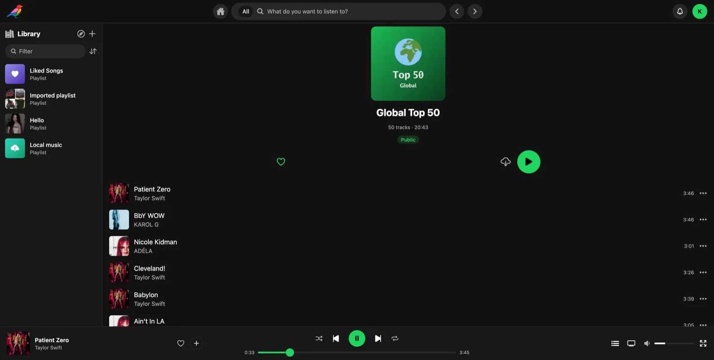
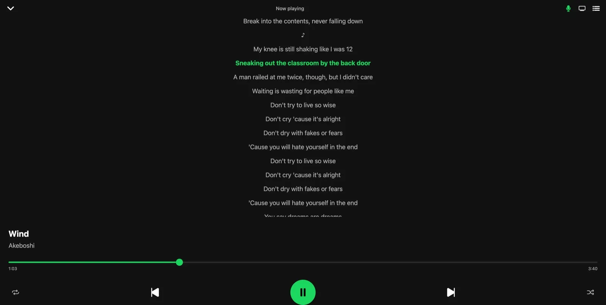
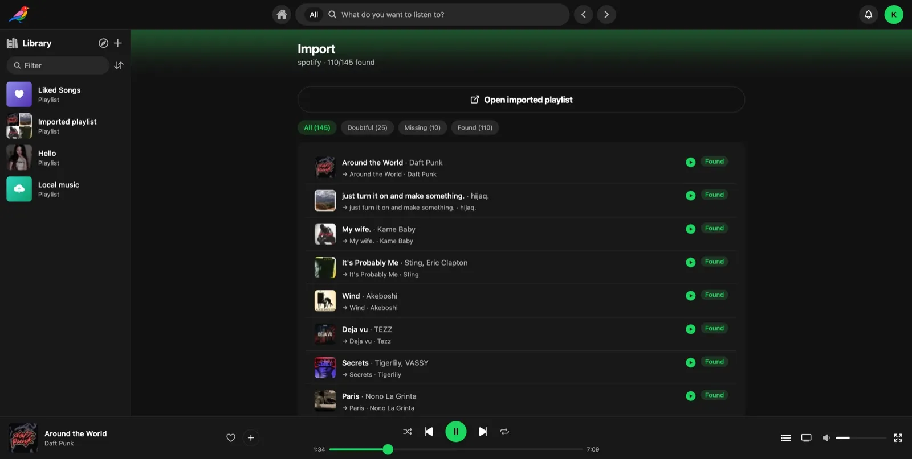
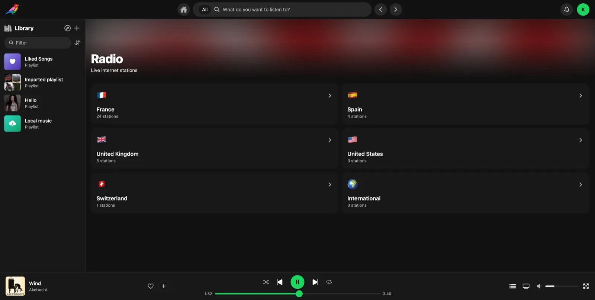

<div align="center">



# 🐦 Immerle

### *Your music, self-hosted and it sings.*

</div>

Meet **Immerle** *(say it “I-mmerle” 🎶)*, a self-hosted music server with
its **own apps** (web, desktop, Android) and a **terminal client** (`iml`),
that also speaks fluent **Subsonic / OpenSubsonic**, so the clients you already
love (Supersonic, Symfonium, DSub, and friends) just work. Then it goes much
further: discovery mixes, radio and podcasts, Jam listening sessions,
multi-device playback, an on-demand catalog, playlist and purchase import,
scrobbling, concert alerts and optional federation. 🎉

One tiny **Go binary**, with the web app embedded. **SQLite** out of the box
(Postgres if you outgrow it). Drop in your music, hit play. That’s it. 🎵

<p align="center">
  
</p>

### What’s in a name? 🤔

A little wink at [**Immich**](https://github.com/immich-app/immich), the
beloved self-hosted photo server whose name remains one of the great unsolved
mysteries of the homelab world 🕵️, crossed with ***merle***, French for
**blackbird** 🐦, the songbird famous for its joyful, improvised whistling. A
self-hosted server, for music, that sings: **Immerle**. ✨

---

## ✨ What you get

- 📱 **Its own apps**: a web app served by the server itself, desktop
  installers (macOS, Windows, Linux) and an Android APK. Capability-aware: it
  only shows what your instance has enabled.
- ⌨️ **`iml`, a terminal client**: search and play from a terminal, with
  near-zero RAM/CPU, perfect next to a game.
- 🎧 **Works with your Subsonic clients**: browsing, search, streaming,
  transcoding, playlists, scrobbling, now-playing.
- 🔁 **Multi-device playback**: pick up where another device left off, or cast
  to one and drive it remotely, Spotify-Connect style.
- 🌍 **On-demand catalog**: pluggable providers (Jamendo, Internet Archive, Free
  Music Archive, and your own HTTP providers) stream tracks you don’t own yet,
  *progressively* on first play, then keep them in your library.
- ✨ **Discovery**: genre/decade/trending/chart playlists, personal "made for
  you" lists, recommendation mixes (ReccoBeats, ListenBrainz Daily/Weekly Jams,
  a Last.fm similarity mix), a hand-curated Hall of Fame and a yearly
  *Wrapped*.
- 📻 **Internet radio & 🎙️ podcasts**: curated built-in stations per country,
  plus podcast subscriptions searchable from Apple Podcasts, Podcast Index,
  fyyd and more.
- 📡 **Scrobbling**: push your plays to ListenBrainz and/or Last.fm.
- 👯 **Social**: an activity feed with per-event privacy, a member directory,
  collaborative or public/subscribable playlists, and public share links.
- 🔊 **Jam sessions**: listen together, in sync, streamed live, with invites.
- 📥 **Playlist import**: bring your playlists over from Spotify or Deezer.
- 🛍️ **Purchase import**: connect Bandcamp and import the real files you paid
  for.
- 🎫 **Concert discovery (opt-in)**: upcoming shows for your top artists near
  you (Ticketmaster, Skiddle, Eventim).
- 🎤 **Lyrics & karaoke**: embedded/sidecar lyrics, with an
  [lrclib.net](https://lrclib.net/) fallback for synced lyrics.
- 🔗 **Federation (opt-in)**: sync playlists between instances via an
  `immerle-hub`.
- 🔐 **Solid auth**: Subsonic tokens, revocable device JWTs, personal API
  tokens, optional **LDAP** login, and built-in brute-force login throttling.
- 📖 **OpenAPI 3.1** + a built-in Swagger UI for the native API.

## 📸 A quick look

| Charts & discovery | Synced lyrics |
| :---: | :---: |
|  |  |
| **Playlist import** | **Internet radio** |
|  |  |

## 🚀 Quick start

### 🐳 Docker

Uses the prebuilt multi-arch image from GHCR, no local build needed.

```bash
# put your music under ./music, then:
docker compose up -d
# server on http://localhost:4533: sign in with the ADMIN_USERNAME/ADMIN_PASSWORD
# you set in docker-compose.yml (or use the web UI's setup screen if you left them unset)
```

Or without compose:

```bash
docker run -d -p 4533:4533 \
  -v "$PWD/music:/music:ro" -v immerle-data:/data \
  -e DATABASE_DSN=/data/immerle.db -e LIBRARY_DATA_DIR=/data \
  -e ADMIN_USERNAME=admin -e ADMIN_PASSWORD=change-me \
  ghcr.io/immerle/immerle:latest
```

> Building from your checkout instead? Uncomment `build:` in
> `docker-compose.yml` and run `docker compose up --build`.

### 🛠️ From source

```bash
make build
cp .env.example .env   # edit as needed
./bin/immerle          # auto-loads .env (or pass -env path/to/.env)
```

You’ll need **Go 1.26+** and `ffmpeg`/`ffprobe` on your `PATH` (for transcoding,
duration probing and on-demand tag embedding).

Then point any Subsonic client at `http://<host>:4533` with the credentials you
just created, and enjoy. 🎈

### 💻 Desktop app

Grab the installer for your OS from the
[latest release](../../releases/latest) (`.dmg`, `.exe`, `.AppImage`/`.deb`).

> **macOS:** the build is ad-hoc signed but not notarized, so Gatekeeper blocks
> the first launch (and on recent macOS the old right-click → Open trick no
> longer offers an override). Clear the download quarantine, then open it:
>
> ```bash
> xattr -dr com.apple.quarantine /Applications/Immerle.app
> ```
>
> Or, without the terminal: try to open it once, then go to **System Settings →
> Privacy & Security → Open Anyway**.

### 📱 Android

```bash
wget https://github.com/immerle/immerle/releases/latest/download/immerle.apk
```

Install it directly (you'll need to allow installs from your file manager /
browser).

### ⌨️ iml: terminal client

A minimal, UI-less terminal client: search songs/albums/playlists and play.
Release filenames don't carry a version, so `releases/latest/download/...`
always grabs the newest build, pick your OS/arch:

```bash
wget https://github.com/immerle/immerle/releases/latest/download/iml-linux-amd64.tar.gz
tar xzf iml-linux-amd64.tar.gz
./iml
```

Other targets: `linux-arm64`, `darwin-amd64`, `darwin-arm64` (`.tar.gz`),
`windows-amd64`, `windows-arm64` (`.zip`).

Or straight from source: `go install github.com/immerle/immerle/cmd/iml@latest`.

## 📚 Going further

The friendly bit ends here; the full reference lives on the
**[docs site](https://immerle.com/docs/)**:

- 🚀 [Quick Start](https://immerle.com/docs/get-started/quick-start) and [security basics](https://immerle.com/docs/get-started/security), read before exposing it
- 📱 [Connecting clients](https://immerle.com/docs/clients): the app, `iml`, or any Subsonic client
- ⚙️ [Configuration](https://immerle.com/docs/configuration): bootstrap `.env` + runtime admin settings, LDAP
- 🌍 [On-demand catalog](https://immerle.com/docs/features/on-demand-providers): enable providers, add your own
- ✨ [Discovery](https://immerle.com/docs/features/discovery): auto-generated playlists, recommendation mixes, Hall of Fame, Wrapped
- 📻 [Radio & podcasts](https://immerle.com/docs/features/radio-podcasts)
- 📡 [Scrobbling](https://immerle.com/docs/features/scrobbling): ListenBrainz and Last.fm
- 👯 [Social features](https://immerle.com/docs/features/social): activity, members, sharing, Jam sessions
- 📥 [Playlist import](https://immerle.com/docs/features/playlist-import) and 🛍️ [purchase import](https://immerle.com/docs/features/purchase-import)
- 🎫 [Concert discovery](https://immerle.com/docs/features/concert-discovery)
- 🔗 [Federation](https://immerle.com/docs/features/federation): sync playlists via an `immerle-hub`
- 💻 [Developers](https://immerle.com/docs/developers/architecture): architecture, the native & Subsonic APIs, custom providers, build/test/contribute

## 🤝 Contributing

Issues and pull requests are very welcome! 🙌 Before opening a PR, run `make ci`
(it must pass) and regenerate the OpenAPI spec with `make openapi` if you touched
handler annotations, CI fails on a stale spec. See
[Architecture & development](https://immerle.com/docs/developers/architecture) for the full loop.

## ⚖️ Disclaimer

Immerle's on-demand provider system is **content-neutral** by design: it can be
pointed at any backend. That neutrality is purely technical and is not an
endorsement of any particular use. **You are solely responsible** for ensuring
you have the legal right to access, store and distribute whatever content you
connect, and for complying with all applicable copyright and other laws. Immerle
and its maintainers provide the software only and **disclaim all responsibility
and liability** for how it is used or what content is served through it. See
[DISCLAIMER.md](DISCLAIMER.md).

## 🎨 Credits

The Immerle logo was designed by **Alicia SMITI**, thank you! 💖

## 📜 License

Immerle is free software, licensed under the **[GNU AGPLv3](LICENSE)**. You’re
free to use, study, share and improve it, just keep it free, and if you run a
modified version as a network service, share your changes too. 💚
